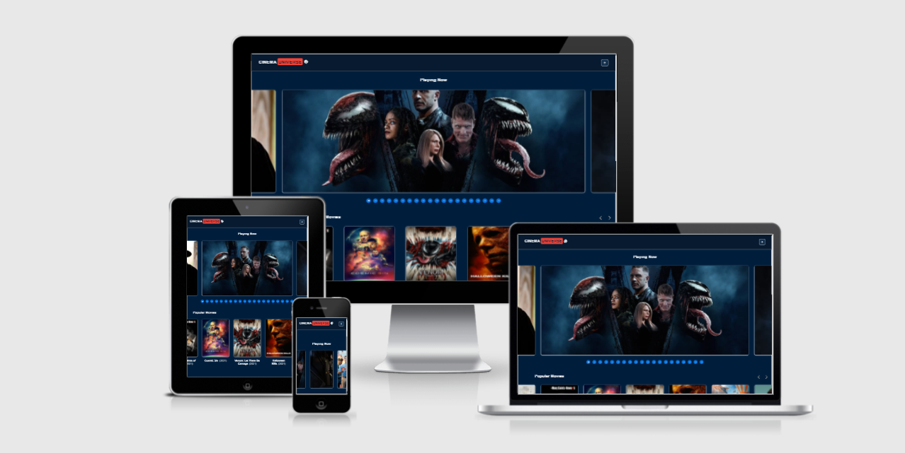
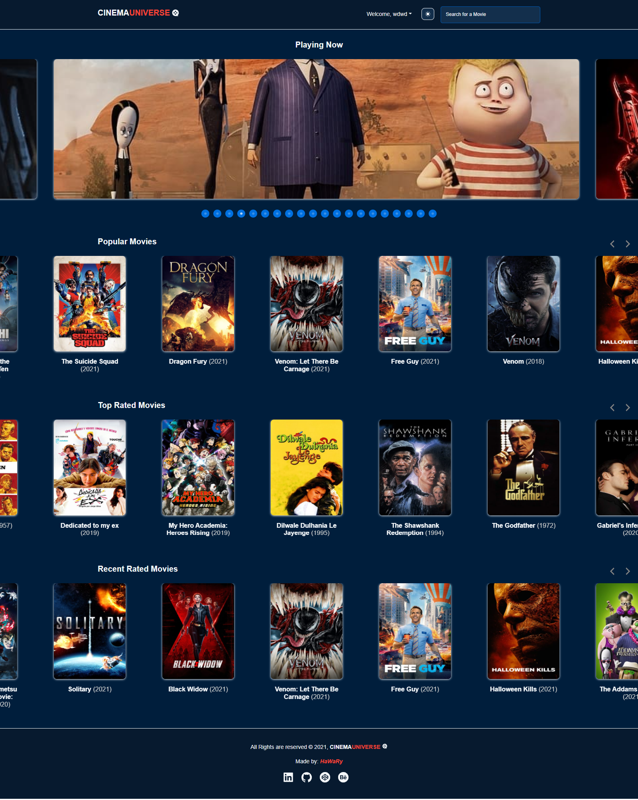
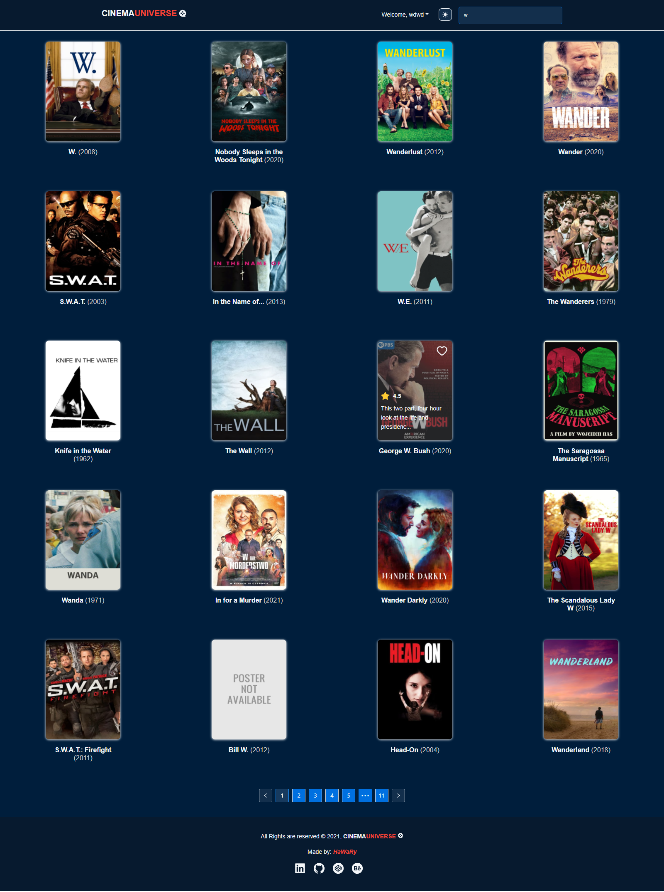
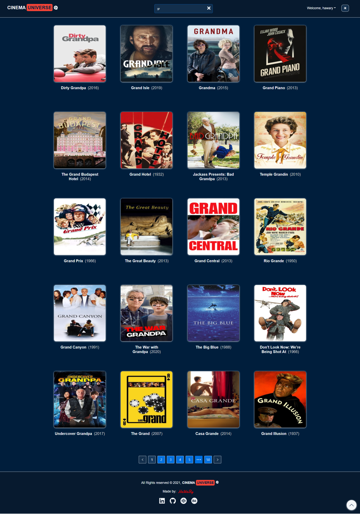

# Cinema Universe

[](https://app.netlify.com/sites/cinemauniverse/deploys)

Cinema Universe is a large Database website for all movies since the beginning of Cinema. It depends on the API of TMDB website, which is the largest database website for Movies and TV Shows in the world.

You can view the website from [here](https://cinemauniverse.netlify.app/)

 
 
 

## Demo

https://user-images.githubusercontent.com/69651552/138542024-937ee1bd-c31c-435b-88ad-0e4435b10ce3.mp4

## Instructions, Building & Get Started 

    - 1- Fork, clone or download this repository to your local machine.
    - 2- Be sure that you install the Node.js environment in your machine.
    - 3- Open your terminal and be sure that you are inside the correct destination of the website, while you must be in the same path of the package.json file.
    - 4- Create a (.env) file and add the following environment variables into it:

        ```
        REACT_APP_TMDB_URL="Add here the TMDB base URL"
        REACT_APP_TMDB_API_KEY="Add here the TMDB API Key"
        ```
    - 5- Inside your terminal run these commands:-
    
        * to install dependencies.
        ```
        npm install
        ```
        * to start the server.
        ```
        npm start
        ```
    - 6- Once the website server is running, visit (localhost:3000) in the browser to view the website and now you can treat with it as shown above in the Demo.
    - 7- You can also see a live preview of the website from this link (https://cinemauniverse.netlify.app/)

## Features 

* Switch between Dark and Day Mode

 

 

* PWA [Progressive Web App] introduces the website with another 2 versions beside the web version. It will be in a Mobile version [Android or IPhone] and in a Desktop version for PCs, this means that you can download the website and install it in your PC or laptop as a desktop App or download and install it in your mobile phone like any App in your phone.

* Service Worker improves the User Experience for the website, as if your connection to the internet is lost so the browser will not be crashed and go to the weird [No Connection] screen, but instead of that there will be a nice screen with a proper message that shows to the user that there is no internet connection and he has to check his internet.

## Pages

* Login
* Home
* My Favorites
* 404 

## Built with

* HTML
* CSS
* JS

## Libraries & Packages

* [Redux](https://redux.js.org/)
* [React Redux](https://react-redux.js.org/)
* [Redux Thunk](https://www.npmjs.com/package/redux-thunk)
* [React Router](https://www.npmjs.com/package/react-router)
* [React Router Dom](https://www.npmjs.com/package/react-router-dom)
* [Styled Components](https://styled-components.com/)
* [Axios](https://www.npmjs.com/package/axios)
* [React Icons](https://react-icons.github.io/react-icons/)
* [React Slick](https://www.npmjs.com/package/react-slick)
* [React Youtube](https://www.npmjs.com/package/react-youtube)

## Frameworks 

* [React](https://reactjs.org/)  
* [Ant Design](https://ant.design/)
* [React Bootstrap](https://react-bootstrap.github.io/)

## API

* [TMDB](https://www.themoviedb.org/)

## Notices & Overview about the website

1- The website has a Simulation for the Authentication process, so you have to enter any username and any password from you choice in the login form to be able to see the home screen of the website.

2- The username and password you entered in the login form generate a unique Token that will be saved in the browser Local Storage with the username. So this unique Token & username are your tokens to check your Auth state before every request you perform inside the website, so don't try to delete your tokens from the Local Storage otherwise you will be logged out once you make any request inside the website and therefore you will lost all your data including your saved favorites movies [will talk about it in point (3)], and will lost your chosen Theme (Dark or Day) [will talk about it in point (5)]. Because the website doesn't have any backend database that saves your works in the website. It depends ONLY on the client side >> [Local Storage]. So deleting your LocalStorage here or clicking on the [Logout] Link in the dropdown menu in the Navbar are similar to deleting your Account forever.

3- You can choose any movie in the website as your favorite movie, by clicking on the heart icon at the top right of each movie poster, and this choice as a favorite movie will be saved in the Local Storage also to prevent loss your favorites data if you make a reloading for the website. Also you can remove this favorite movie from your favorites list by clicking another mouse click on the heart icon again.

4- You can also see all your favorites Movies you chosen before by navigating to the "My Favorites Page", in the Navbar, open the dropdown menu and click on the [My Favorites] Link to go to your favorites Movies.  

5- You can choose your favorite Theme between (Dark & Day) and this choice will be saved in the Local Storage also, so your preferred Theme will not be lost after reloading the website.

6- The website contains 4 main sliders in the Home Screen:-
    - The Top Slider is for the [Now Playing Movies] in the Cinema
    - The Second Slider is for the [Popular Movies]
    - The Third Slider is for the [Top Rated Movies]
    - The Fourth is for the [Recent Rated Movies]

7- If you click on any movie, a movie modal will be opened that contains all this movie details:- [Title, Release Date, Genres, Overview, Cast, Crew, Video Trailer]

7- You have the ability to search for any movie you need in a large database contains millions of movies, by just typing its name letters in the search input at the top of the screen and you will get the results that match your needs.

8- The website depends for its database on the TMDB Website API's, TMDB is the largest Database Website for Movies and TV Shows in the World, you can check all the API's and the URLs that this website depends on them in the (config.js) file inside the (src) folder.

9- Finally, you can consider this website as a reference and strong practical & revision to understand the working logic of `redux`, `react-redux` & middleware like `redux-thunk` and how they interact with a react website.

## Author

* [Mohamed Elhawary](https://www.linkedin.com/in/mohamed-elhawary14/) 

## Contact me through my social accounts

* Email: mohamed.k.elhawary@gmail.com
* [Linkedin](https://www.linkedin.com/in/mohamed-elhawary14/)
* [Github](https://github.com/Mohamed-Elhawary)  
* [Behance](https://www.behance.net/mohamed-elhawary14)
* [Codepen](https://codepen.io/Mohamed-ElHawary) 

## License

Licensed under the [MIT License](LICENSE)
